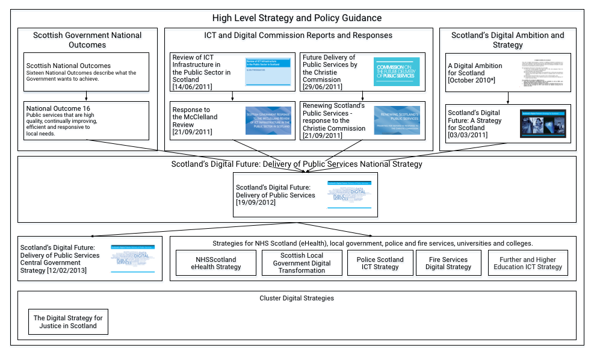
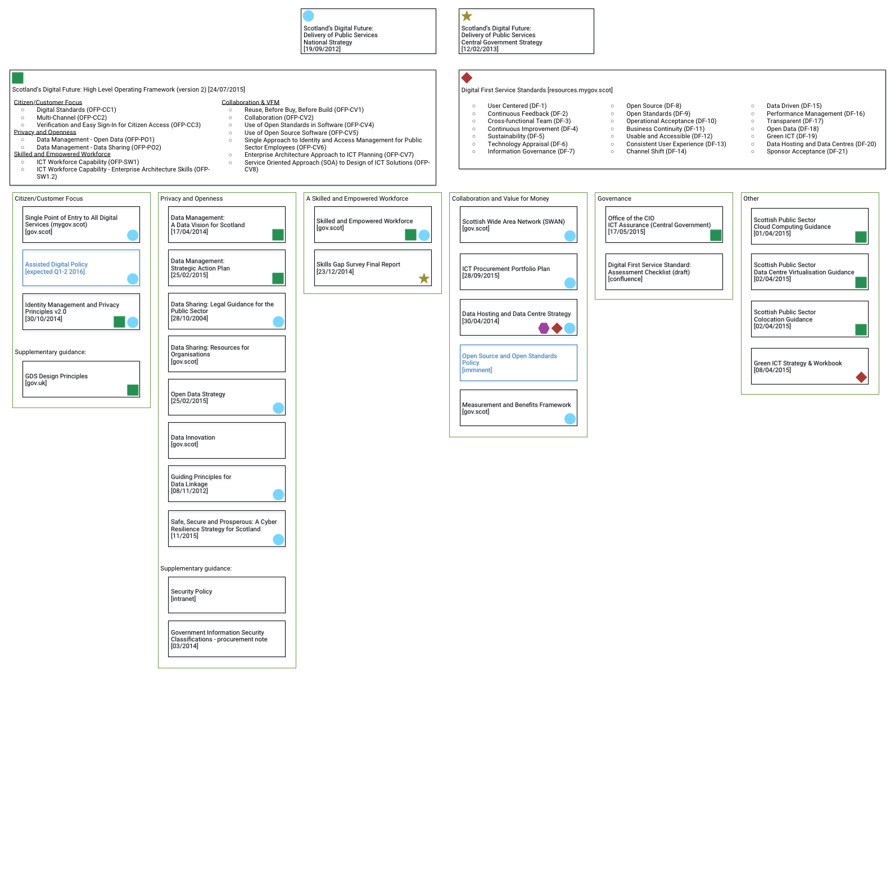

# Digital Public Services Policy and Strategy Documentation

## Purpose

This document captures the strategy landscape for Digital Public Services in Scotland.  That is, it attempts to identify relevant policy, strategy, principles and guidance relevant to the creation and on-going evolution and operation of Digital Public Services.

The aim of the document is to be as comprehensive as possible in terms of identifying relevant sources, but the detail of the guidance remains within these sources.  Links are provided where possible.

The terms policy, strategy, standards, principles and guidance are used widely, often with overlapping meaning.  Our definitions are provided here [tbc].

Please note that this document is work in progress.  All corrections, updates, additions and comments are welcome to <mailto:keith.turnbull@gov.scot>.

## Contents

<!--TOC max1-->

## Revision History

| Version | Issued     | Comments
| -       | -          | -
|     0.1 | 04-12-2015 | Initial draft for discussion and review. |
| 0.2 | 18-12-2015 | Consolidated version published to html & PDF - again for review. |

## Distribution List

| Role                     | RACI                                      |
| -                  | -
| DPS & BT Division | Responsible, Accountable, Consulted and Informed. |

## Review

| -                  | -
| *Review frequency* | quarterly
| *Next review due*  | 31/03/2016

## High Level Policy and Strategy Documents

The following diagram shows the high level policy and strategy documentation relating to Digital Public Services.

<map name="GraffleExportHLPAS">  <area shape=rect coords="46,514,179,555" href="http://www.gov.scot/Publications/2014/08/5429">  <area shape=rect coords="690,416,799,457" href="http://www.firescotland.gov.uk/media/669265/140925_item_9a_ict_digital_strategy_appendix.pdf">  <area shape=rect coords="29,260,957,370" href="http://www.gov.scot/Publications/2012/09/6272/0">  <area shape=rect coords="810,416,943,457" href="http://www.sfc.ac.uk/funding/FundingOutcomes/Learners/ictstrategy/ICTStrategy.aspx">  <area shape=rect coords="577,416,686,457" href="http://www.spa.police.uk/assets/126884/175734/item14-ict-strategic-blueprint">  <area shape=rect coords="435,416,568,457" href="http://lgictstrategy.org.uk">  <area shape=rect coords="292,416,425,457" href="http://www.gov.scot/Publications/2015/03/5705/0">  <area shape=rect coords="39,87,247,151" href="http://www.gov.scot/About/Performance/scotPerforms/outcome">  <area shape=rect coords="182,406,259,454" href="http://www.gov.scot/Publications/2013/02/4411/0">  <area shape=rect coords="29,393,269,467" href="http://www.gov.scot/Publications/2013/02/4411/0">  <area shape=rect coords="739,89,947,153" href="http://www.gov.scot/Publications/2010/10/Digital/Digital-Ambition">  <area shape=rect coords="620,95,697,143" href="http://www.gov.scot/Publications/2011/06/27154527/0">  <area shape=rect coords="498,87,706,151" href="http://www.gov.scot/Publications/2011/06/27154527/0">  <area shape=rect coords="407,96,483,144" href="http://www.gov.scot/Publications/2011/06/15104329/0">  <area shape=rect coords="282,87,490,151" href="http://www.gov.scot/Publications/2011/06/15104329/0">  <area shape=rect coords="407,176,484,224" href="http://www.gov.scot/Publications/2011/09/21103403/0">  <area shape=rect coords="282,168,490,232" href="http://www.gov.scot/Publications/2011/09/21103403/0">  <area shape=rect coords="387,286,627,360" href="http://www.gov.scot/Publications/2012/09/6272/0">  <area shape=rect coords="864,182,940,230" href="http://www.gov.scot/Publications/2011/03/04162416/0">  <area shape=rect coords="739,174,947,238" href="http://www.gov.scot/Publications/2011/03/04162416/0">  <area shape=rect coords="621,176,698,224" href="http://www.gov.scot/Publications/2011/09/21104740/0">  <area shape=rect coords="498,168,706,232" href="http://www.gov.scot/Publications/2011/09/21104740/0">  <area shape=rect coords="39,168,247,232" href="http://www.gov.scot/About/Performance/scotPerforms/outcome/pubServ"> </map>  

## Detailed Principles, Strategies and Policies

The following diagram shows more detailed principle, strategies and policies.

<map name="GraffleExportDPSP"> 	<area shape=rect coords="1077,451,1285,515" href="http://confluence.digital.gov.uk/display/MGV/Digital+First+Standard:+Assessment+Checklist"> 	<area shape=rect coords="299,1105,507,1169" href="http://www.gov.scot/Topics/Government/Procurement/policy/SPPNSSPANS/policy-notes/SPPN2014/3-2014"> 	<area shape=rect coords="40,642,248,706" href="https://www.gov.uk/design-principles"> 	<area shape=rect coords="1336,535,1544,599" href="http://www.gov.scot/Publications/2015/04/4179"> 	<area shape=rect coords="1336,451,1544,515" href="http://www.gov.scot/Publications/2015/04/2741"> 	<area shape=rect coords="1077,367,1285,431" href="http://www.gov.scot/Topics/Economy/digital/CIO/Assurance"> 	<area shape=rect coords="1336,370,1544,434" href="http://www.gov.scot/Publications/2015/04/1707"> 	<area shape=rect coords="558,444,766,508" href="http://www.gov.scot/Topics/Economy/digital/digitalservices/workforce/SGA"> 	<area shape=rect coords="202,563,221,582" href="http://www.gov.scot/Topics/Economy/digital/digitalservices/datamanagement/IdentityandPrivacy/IdentityManagementandPrivacyPrinciplesV2"> 	<area shape=circle coords="236,573,9" href="http://www.gov.scot/Topics/Economy/digital/digitalservices/datamanagement/IdentityandPrivacy/IdentityManagementandPrivacyPrinciplesV2"> 	<area shape=rect coords="40,522,248,586" href="http://www.gov.scot/Topics/Economy/digital/digitalservices/datamanagement/IdentityandPrivacy/IdentityManagementandPrivacyPrinciplesV2"> 	<area shape=circle coords="1013,420,9" href="http://www.gov.scot/Topics/Economy/digital/digitalservices/strategy"> 	<area shape=rect coords="818,367,1026,431" href="http://www.gov.scot/Publications/2014/04/1578/0"> 	<area shape=rect coords="558,367,766,431" href="http://www.gov.scot/Topics/Economy/digital/digitalservices/workforce"> 	<area shape=rect coords="817,694,1025,758" href="http://www.gov.scot/Topics/Economy/digital/digitalservices/MandBframework"> 	<area shape=rect coords="818,451,1026,515" href="http://www.gov.scot/Topics/Government/Procurement/directory/ictportfolioplan/ictpppdown"> 	<area shape=rect coords="299,1026,507,1090" href="http://intranet/InExec/SEAndMe/IT/StrategiesPolicies/SecurityPolicy/intro"> 	<area shape=rect coords="299,908,507,972" href="http://www.gov.scot/Publications/2015/11/2023"> 	<area shape=rect coords="40,367,248,431" href="http://www.gov.scot/Topics/Economy/digital/digitalservices/mygovscot"> 	<area shape=rect coords="299,828,507,892" href="http://www.gov.scot/Publications/2012/11/9015/0"> 	<area shape=rect coords="299,751,507,815" href="http://www.gov.scot/Topics/Economy/digital/digitalservices/datamanagement/datainnovation"> 	<area shape=rect coords="299,674,507,738" href="http://www.gov.scot/Publications/2015/02/6614/0"> 	<area shape=rect coords="299,598,507,662" href="http://www.gov.scot/Topics/Economy/digital/digitalservices/datamanagement/datasharing/shareresponsibly"> 	<area shape=rect coords="299,521,507,585" href="http://www.gov.scot/Publications/2004/10/20158/45768"> 	<area shape=rect coords="299,444,507,508" href="http://www.gov.scot/Publications/2015/02/5136/0"> 	<area shape=rect coords="816,15,1056,95" href="http://www.gov.scot/Publications/2013/02/4411/0"> 	<area shape=rect coords="535,15,775,95" href="http://www.gov.scot/Publications/2012/09/6272/0"> 	<area shape=rect coords="817,532,1025,596" href="http://www.gov.scot/Publications/2014/04/1578/0"> 	<area shape=rect coords="299,367,507,431" href="http://www.gov.scot/Topics/Economy/digital/digitalservices/datamanagement/dmbvfs/dmbvfspdf"> 	<area shape=rect coords="1336,619,1544,683" href="http://www.gov.scot/Topics/Economy/digital/digitalservices/greenict"> 	<area shape=rect coords="1069,172,1318,295" href="http://www.gov.scot/Publications/2015/04/4179"> 	<area shape=rect coords="816,124,1574,300" href="http://resources.mygov.scot/standards/digital-first/"> 	<area shape=rect coords="389,170,772,319" href="http://www.gov.scot/Publications/2015/07/2901"> 	<area shape=rect coords="20,170,402,326" href="http://www.gov.scot/Publications/2015/07/2901"> 	<area shape=rect coords="17,124,775,329" href="http://www.gov.scot/Publications/2015/07/2901"> </map>

